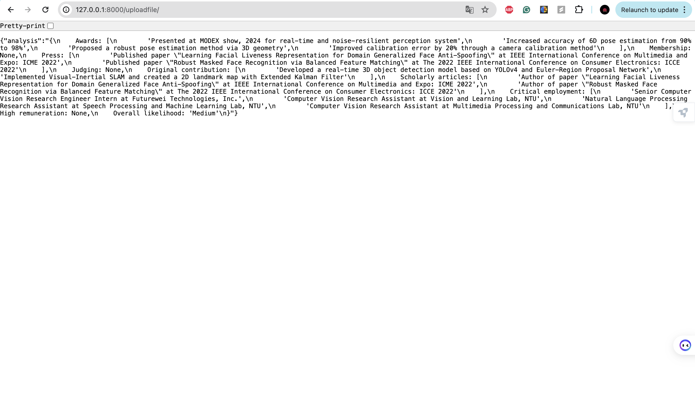

# O-1A Visa Qualification Assessment

## Overview
This application assesses how a person is qualified for an O-1A immigration visa based on their CV. The assessment is done by extracting relevant information from the CV and matching it against the 8 O-1A criteria.

## Functional Requirements
- List all the things that the person has done and meet the 8 criterion of O-1A
- Give a rating (low, medium, high) on the chance that this person is qualified for an O-1A immigration visa

## Tech Requirements
- Create a system design to fulfill the above requirements
- Implement an API that takes the input of a CV as a file and produces the two things described above
- Use FastAPI to implement the endpoint
- For anything related to ML/AI, please consider using LLMs unless there is a strong reason why not

## Setup and Running
1. Clone this repository:
  ```bash
  git clone git@github.com:lintsao/O-1A-Visa-Qualification-Assessment.git
  ```

2. Create a new virtual environment:
  ```bash
  python3 -m venv env
  source env/bin/activate  # For Unix/Linux
  ```

3. Install the required dependencies:
  ```bash
  pip3 install -r requirements.txt
  ```

4. Put your **OPENAI_API_KEY** to an **.env** file.
  ```bash
OPENAI_API_KEY="YOUR_OPENAI_API_KEY"
  ```

## Usage
1. Run the FastAPI server:
```
uvicorn main:app --reload
```
Now, open your browser and navigate to http://127.0.0.1:8000. You can upload a PDF file and see the extracted text, analysis results, and the criteria used for the O-1A visa qualification. This setup integrates the JSON file containing the criteria into the FastAPI application.




## Design Flow
The system takes an input (CV in PDF format), processes it through a resume parser, and then analyzes it using an LLM (Large Language Model) to generate evaluation results. The flow consists of the following steps:
#### 1. Connect to OpenAI Client: 
Utilize OpenAI's GPT-3.5 for natural language processing analysis. Note: GPT-4.0 can directly take PDF files as input for more streamlined processing.

#### 2. Read Criteria from JSON: 
Load the criteria from **O-1AEvidentiaryRequirements.json** to reference O-1A visa qualification standards.

#### 3. User Interface with FastAPI: 
Allow users to upload their CV via a FastAPI endpoint, which then parses the PDF files to extract text.

#### 4. Qualification Analysis: 
Analyze the extracted text to evaluate the candidate's qualifications against the O-1A visa criteria.

#### 5. Display Analysis Results: 
Present the evaluation results in a user-friendly format. 

## Future Work
- Create a better UI for visualizing the results.
- Try different models to perform the NLP analysis.